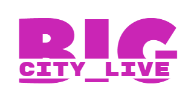

# 🏙️ BIG CITY LIVE - Events Platform



A modern web platform that brings all city events to one place. Residents and visitors can discover, explore, and purchase tickets for various events in Astana.

## 🎯 Project Overview

## Deployment: https://ik-akx.github.io/WEB_BIGCityLive_a5/

**BIG CITY LIVE** is a comprehensive events management system that solves the problem of scattered event information by providing a unified platform where users can:

- 🔍 **Discover** all city events in one place
- 🎫 **Purchase tickets** seamlessly  
- 👤 **Manage personal profiles** and tickets
- 📱 **Enjoy responsive design** across all devices
- 🌙 **Switch between light/dark modes**

## ✨ Features

### 🎪 Event Management
- **Event Catalog** - Browse concerts, sports, shopping events
- **Advanced Filtering** - Filter by category, price, date
- **Search Functionality** - Find events quickly
- **Event Details** - Comprehensive event pages with countdowns

### 👥 User System
- **User Registration & Authentication** - Secure signup/login
- **Profile Management** - Personal information and ticket history
- **Ticket Purchasing** - One-click ticket buying with API integration
- **Responsive User Interface** - Works on desktop, tablet, mobile

### 🎫 Ticket System
- **Real-time Availability** - 100 tickets per event limit
- **Instant Purchase** - Smooth checkout process
- **Ticket History** - View all purchased tickets in profile
- **API Integration** - External REST API for ticket management

### 🎨 User Experience
- **Dark/Light Mode** - Customizable theme switching
- **Responsive Design** - Optimized for all screen sizes
- **Smooth Animations** - Enhanced user interactions
- **Modern UI/UX** - Professional and intuitive interface

## 🚀 Live Demo

🌐 **Live Website:** [BIG CITY LIVE](https://your-username.github.io/big-city-live)

🔗 **API Endpoint:** [External Events API](https://github.com/IK-akx/WEB_BCL_API)

## 🛠️ Technology Stack

### Frontend
- **HTML5** - Semantic markup
- **CSS3** - Modern styling with animations
- **JavaScript (ES6+)** - Interactive functionality
- **Bootstrap 5** - Responsive framework
- **LocalStorage** - Client-side data persistence

### Backend API
- **Node.js** - Runtime environment
- **Express.js** - Web framework
- **RESTful Architecture** - API design
- **CORS Enabled** - Cross-origin requests


## 🎪 API Integration

### External Events API
The project integrates with a custom-built REST API for ticket management:

**Repository:** [WEB_BCL_API](https://github.com/IK-akx/WEB_BCL_API)

### API Endpoints
- `GET /api/events` - Fetch all events
- `GET /api/events/:id` - Get specific event details
- `GET /api/users/:id/tickets` - Retrieve user tickets
- `POST /api/tickets` - Purchase new tickets
- `DELETE /api/tickets/:id` - Cancel tickets

### Example Usage
```javascript
// Purchase ticket
const result = await realEventAPI.buyTicket(userId, eventId, quantity);

// Get user tickets
const tickets = await realEventAPI.getUserTickets(userId);
```

## 👥 Development Team
### Team Members
- Iskander Kustayev
- Olzhas Omerzak
- Bekbolat Yergalyuly

### Roles & Contributions
- Frontend Development - All team members
- Backend API - Iskander Kustayev
- UI/UX Design - Collaborative effort
- Project Management - Team collaboration

## 🚀 Installation & Setup
## Prerequisites
 - Modern web browser (Chrome, Firefox, Safari, Edge)
 - GitHub account for deployment
 - (Optional) Node.js for local API development

## Local Development
### Clone the repository

```bash
git clone https://github.com/your-username/big-city-live.git
cd big-city-live
```

### Set up the API (optional)


```bash
# Clone API repository
git clone https://github.com/IK-akx/WEB_BCL_API.git
cd WEB_BCL_API
npm install
npm start
```

### Open the project

- Open index.html in your browser, or
- Use a local server: python -m http.server 3001

## 🎯 Project Requirements Met
### Core Requirements
 - Responsive Design - Works on desktop, tablet, mobile
 - GitHub Hosting - Deployed on GitHub Pages
 - Light/Dark Modes - Theme switching functionality
 - Professional Design - Polished, readable interface
 - Enhanced JavaScript - Authentication, form validation, search
 - External API Integration - Custom events API
 - Feature Cohesion - All features align with project theme

### Technical Implementation
 - User Authentication - Sign up, login, profile management
 - Local Storage - User data and preferences persistence
 - Form Validation - Comprehensive input validation
 - Search & Filter - Event discovery functionality
 - REST API Integration - External service communication

### 📞 Contact & Support
- Email: info@bigcitylive.com
- Phone: +7 777 777 7777
- Address: st. Mangylyk El C1, Astana, Kazakhstan